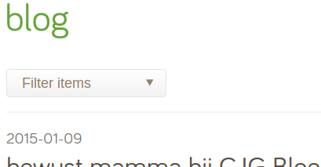

Filterable archive - filter pages by date, tag or category
==========================================================

This module decorates pages with configurable fields to filter them by. Handy for newsitems & blogs, etc.
(Largely adapted & decoupled from micmania1/silverstripe-blogger)

*Filter items via dropdowns by date (paginated).*



## Features

* Apply decorators to filter pages by date (year, month/year, or day/month/year)
* Filtering by Tags & Categories & corresponding extensions


## Installation

```
composer require micschk/silverstripe-filterablearchive dev-master
```

Then add the decorators & criteria (todo) which you want to filter by to config.yml:

```yaml
---
name: 'filterablearchiveextensions'
---
NewsHolder:
  extensions:
    - 'FilterableArchiveHolderExtension'
  pagination_control_tab: "Root.Subpages" # name of tab for pagination settings, defaults to "Root.Main"
  pagination_insert_before: "Subpages" # optional, set position of tab
  managed_object_class: "NewsItem"
  managed_object_date_field: "Date"
NewsHolder_Controller:
  extensions:
    - 'FilterableArchiveHolder_ControllerExtension'
NewsItem_Controller:
  extensions:
    - 'FilterableArchiveItemExtension'
```


## Recommended

Newsgrid module (manage newsitems from a gridfield), applies this module
* [silverstripe-newsgrid](https://github.com/micschk/silverstripe-newsgrid)


## Requirements

* SilverStripe 3.0 or newer